  

<h1 align="center">Hi, I'm Patrick 👋</h1>

  <b>Senior Software Engineer</b> · M.S. Computer Science, Georgia Tech

  I build and run platforms end to end — backend, frontend, integrations, and the cloud
  infrastructure underneath. I like scalable systems, hard technical problems, and software
  that delivers real business value.

---

### 🔭 What I do

- **Platform & backend** — Python / FastAPI services, SQL, event-driven pipelines (SQS, EventBridge, streams, Rabbit, Kafka).
- **Cloud & infra** — AWS with infrastructure-as-code (Terraform + CDK), CI/CD, and observability.
- **Full-stack** — React / Next.js / TypeScript front ends for the systems I build.
- **AI & data** — data wrangling and analysis with pandas / NumPy, algorithm design, NLP, and applied ML/AI.

### 🚀 What I'm working on

- Building full-stack applications
- Exploring new technologies and best practices
- Contributing to personal and open-source projects
- Creating AI/ML solutions
- Learning, and sharing, better ways to ship safely.

### 🧱 How I write code

I care about code that stays easy to change:

- **DRY & modular** — small, composable pieces and shared helpers over copy-paste.
- **Maintainable** — clear boundaries, single responsibility, and refactoring toward the simplest thing that works.
- **Built to last** — readable, well-tested, documented code the next person (or future me) can change with confidence.

  
### 🛠️ Tech stack

### 📊 GitHub in numbers

  

  
  

  

<!-- Contribution snake — generated by .github/workflows/snake.yml into the `output` branch -->

  

  

### 📫 Connect

  

